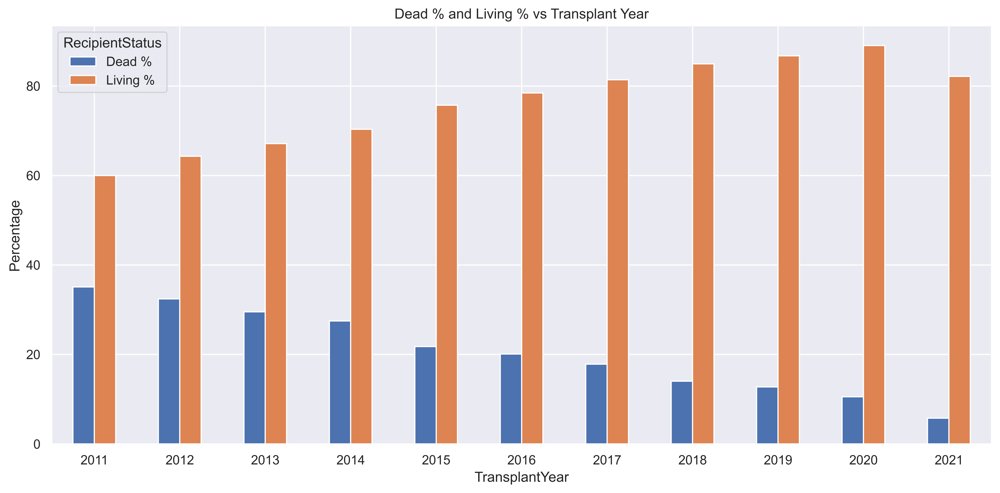
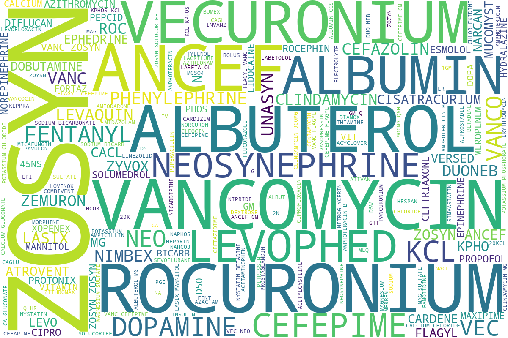

# United Network for Organ Sharing ([UNOS](https://unos.org/))

Heart transplantation is a life-saving intervention for patients with end-stage heart failure, yet predicting long-term survival remains a complex challenge due to the multifaceted nature of donor and recipient characteristics. This study uses the United Network for Organ Sharing (UNOS) dataset, a large, nationally representative registry of heart transplant cases, which serves as a crucial resource in heart transplantation research. The UNOS dataset provides comprehensive and reliable data on donor and recipient characteristics, making it an ideal source for developing and evaluating machine learning models for predicting three-year post-transplant survival. Our study follows a comprehensive data science pipeline that includes data acquisition, rigorous preprocessing (imputation, discretization, and normalization), exploratory data analysis, advanced feature engineering, and feature selection. We benchmarked multiple classification algorithms—Logistic Regression, Random Forest, XGBoost, K-Nearest Neighbors (KNN), and AdaBoost—using stratified cross-validation with Bayesian hyperparameter optimization. Model performance was assessed using AUC-ROC, F1-score, precision, and recall. SHAP (SHapley Additive exPlanations) values were employed to interpret model predictions and identify key predictors of survival, ensuring transparency and robustness in our research. This study aims to improve predictive accuracy and support evidence-based clinical decision-making in heart transplantation by comparing model performance and uncovering the most influential features.

## Dataset Information

    - THORACIC_FORMATS_FLATFILE.htm
        - Contains Column Names
    - THORACIC_FORMATS_FLATFILE.DAT
        - Data
    - Number of columns: 546 & Number of Records: 200,217
        - HR: 128,215  (Heart)
        - LU:  68,079  (Lung)
        - HL:   3,495  (Heart & Lung)

## Feature Space

    - 546 Features containing both candidate and donor
    - Categorical (nominal & ordinal)
    - Continuous numeric variables

## Selection Criteria

    - Transplant Year between 2011 - 2021
    - HL
    - Adult
    - Remove feature containing greater than 80% NaNs

### Heart Dataset Rows: 28,751 & Columns: 306

### PREPROCESSING

We focused our analysis on adult patients, defined as individuals aged 18 years or older, who received a heart transplant between 2011 and 2021. This timeframe was selected to ensure the availability of sufficient follow-up data to evaluate three-year post-transplant survival outcomes, which were used in the study. By restricting to this period, we aimed to capture contemporary clinical practices and outcomes relevant to current heart transplantation care. To ensure the quality and relevance of our dataset, we embarked on a meticulous data cleaning process. We began with a comprehensive registry from the United Network for Organ Sharing (UNOS), which initially included data from 1984 to 2021, and removed any variables that were not currently in use or any duplicate variables. After applying inclusion criteria and data cleaning procedures, the resulting dataset contained 28,751 patient records and 317 features. To address the issue of incomplete data, we excluded features with greater than 80% missing values, as they were primarily categorical. Therefore, a new categorical feature called "Missing" was created for any missing features that were part of the inclusion, thereby retaining enough categorical variables for meaningful analysis. Further data preprocessing steps were undertaken to enhance the dataset's consistency and usability. Categorical features were mapped according to the official UNOS data dictionary, ensuring standardized representation across all variables. Additionally, we updated the data types within the DataFrame to accurately reflect the nature of each variable, such as converting category strings to categorical objects.

### Medication

- **ZOSYN** (piperacillin and tazobactam for injection, USP) is an injectable antibacterial combination product consisting of the semisynthetic antibiotic piperacillin sodium and the β-lactamase inhibitor tazobactam sodium for intravenous administration. Piperacillin sodium is derived from D(-)-α-aminobenzyl-penicillin.
- **Rocuronium** is a nondepolarizing neuromuscular blocker widely used to produce muscle relaxation, facilitating surgery and lung ventilation in both elective and emergent situations.
- **Vancomycin** is a tricyclic glycopeptide antibiotic derived initially from the organism Streptococcus orientalis. Vancomycin is used to treat and prevent various bacterial infections caused by gram-positive bacteria, including methicillin-resistant Staphylococcus aureus (MRSA).
- **Vecuronium** is a nondepolarizing agent that achieves skeletal muscle paralysis by competing with acetylcholine for cholinergic receptor sites and binding with the nicotinic cholinergic receptor at the postjunctional membrane of the motor endplate.
- **Albuterol** is used to prevent and treat difficulty breathing, wheezing, shortness of breath, coughing, and chest tightness caused by lung diseases such as asthma and chronic obstructive pulmonary disease (COPD; a group of diseases that affect the lungs and airways).